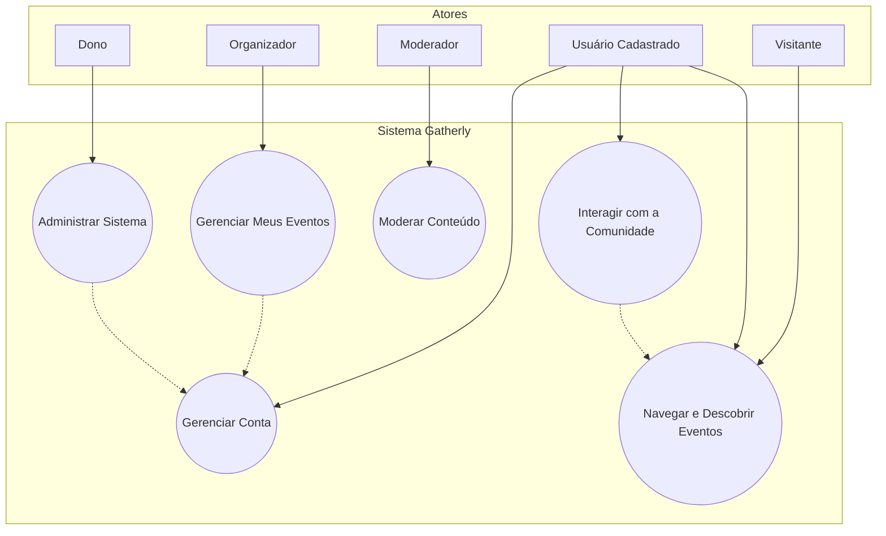

# Visão da Arquitetura & Decisões Iniciais

**Versão**: 01.00.00  
**Data**: 23 de julho de 2025

## Introdução

Este documento apresenta o Diagrama de Casos de Uso para o MVP (Mínimo Produto Viável) do projeto **Gatherly**. O objetivo é oferecer uma visão macro e simplificada das principais interações do sistema, servindo como base para o alinhamento do time e a criação do Product Backlog, sem detalhar todos os fluxos e exceções.

## Atores

Os atores são as entidades que interagem com o sistema. Para o Gatherly, identificamos os seguintes:

- **Atores Primários** (Iniciam ações no sistema)
    - **Visitante (Usuário Não Cadastrado):** Qualquer pessoa que acessa a plataforma sem estar autenticada. Seu principal objetivo é explorar os eventos disponíveis.
    - **Usuário Cadastrado:** Um usuário que possui uma conta e está autenticado. Este é o ator central da plataforma, que pode ser um **Participante** (foco em consumir e interagir) ou um **Organizador** (foco em criar eventos).
    - **Moderador:** Um usuário com permissões especiais para analisar e agir sobre conteúdos denunciados, garantindo a segurança e a qualidade da plataforma.
    - **Dono (Administrador):** O superusuário do sistema, com acesso a todas as funcionalidades administrativas, incluindo a gestão de usuários e papéis.
- **Atores Secundários** (Dão suporte ao sistema)
    - **Sistema:** Representa processos automáticos internos, como o envio de notificações agendadas ou a execução de tarefas de limpeza de dados.
    - **Provedor de Identidade (Google):** O serviço externo do Google (OAuth) que o sistema utiliza para realizar a autenticação via "Login com Google".

## Diagrama de Casos de Uso

## Descrição dos Casos de Uso

A tabela a seguir fornece uma breve descrição para cada caso de uso principal presente no diagrama.

| **Caso de Uso** | **Descrição** |
| --- | --- |
| **Navegar e Descobrir Eventos** | Engloba as ações de exploração da plataforma, como **Buscar Evento**, **Filtrar Evento** (por data, local, categoria) e **Visualizar Detalhes do Evento**. Disponível para todos os atores. |
| **Gerenciar Conta** | Inclui todo o ciclo de vida do usuário: **Criar Conta**, **Realizar Login** (com e-mail ou Google), **fazer logout**, **editar perfil** e **redefinir senha**. |
| **Interagir com a Comunidade** | Ações de engajamento social de um usuário autenticado. Inclui **Marcar Presença em Evento**, **Favoritar Evento**, **Comentar em Evento**, **Compartilhar Evento**, **Criar Alerta**, **Denunciar**. |
| **Gerenciar Meus Eventos** | Ações exclusivas de um **Organizador** para gerenciar seus próprios eventos. Abrange **Criar Evento**, **Editar Evento** e **Deletar Evento**. |
| **Moderar Conteúdo** | Ações exclusivas de um **Moderador**. Consiste em visualizar e **moderar denúncias** feitas por usuários, decidindo se o conteúdo (**evento ou comentário**) deve ser **removido ou mantido**. |
| **Administrar Sistema** | Ações exclusivas do **Dono**. Inclui funcionalidades de gestão global, como **Transformar Usuário em Moderador** e **gerenciar outras configurações** do sistema. |