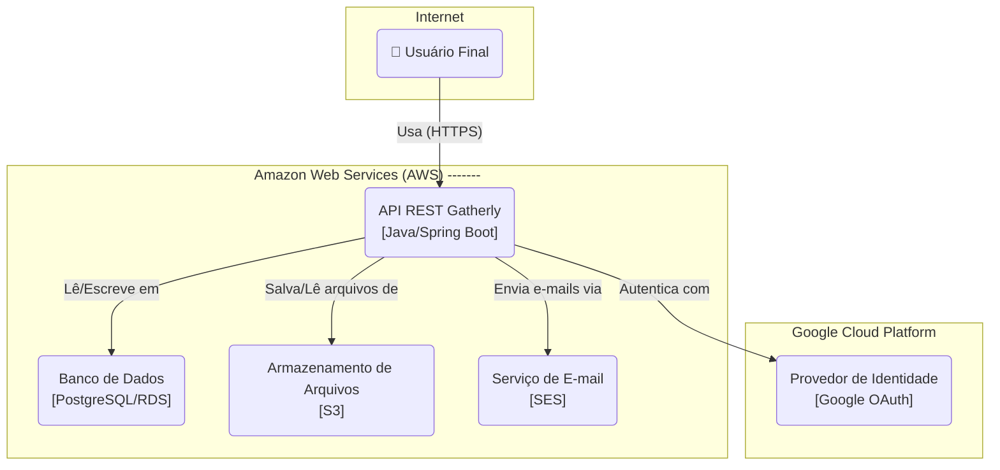

# Visão da Arquitetura & Decisões Iniciais

**Versão**: 01.00.00  
**Data**: 15 de julho de 2025

## Introdução

Este documento delineia a visão arquitetural inicial para o projeto **Gatherly**. Ele deve ser usado como referência pela equipe de desenvolvimento (neste caso, a desenvolvedora do projeto) para a construção do software, garantindo que o desenvolvimento seja consistente, de alta qualidade e alinhado aos objetivos de longo prazo do produto. Ele é um documento vivo e será atualizado conforme novas decisões forem tomadas através de Registros de Decisão de Arquitetura (ADRs).

## Padrão Arquitetural Escolhido

Para o Gatherly, adotaremos a **Arquitetura Hexagonal** (Ports and Adapters).

Esta escolha se justifica pela necessidade de um sistema robusto, testável e de fácil manutenção. A Arquitetura Hexagonal nos permite isolar completamente o núcleo da nossa aplicação (domínio e regras de negócio) de detalhes externos como o framework web, o banco de dados ou serviços de terceiros.

Isso significa que o coração da nossa lógica de negócio não terá conhecimento de que está usando Spring Boot, PostgreSQL ou Amazon S3. Ele apenas se comunica através de "portas" (interfaces Java), e os "adaptadores" (implementações concretas) fazem a ponte com o mundo exterior. Esta separação é crucial para a testabilidade do núcleo da aplicação e para a flexibilidade de evoluir ou trocar tecnologias no futuro com impacto mínimo.

## Princípios de Arquitetura

Os seguintes princípios devem guiar todas as nossas decisões técnicas:

- **API-First (API Primeiro):** Toda funcionalidade do Gatherly será exposta primeiro através de uma API RESTful bem definida e documentada. A interface do usuário é considerada um cliente desta API, assim como qualquer outro sistema poderia ser.
- **Secure by Design (Segurança por Padrão):** A segurança não é uma camada adicionada no final, mas uma preocupação central em todas as fases do desenvolvimento. Cada decisão de design e implementação levará em conta a autenticação, autorização e a proteção dos dados dos usuários.
- **Simplicidade e Evolução (YAGNI & KISS):** Começaremos com a arquitetura e o código mais simples que resolvam o problema de forma eficaz. Evitaremos a complexidade prematura e o excesso de engenharia (over-engineering), permitindo que o sistema evolua de forma orgânica e sustentável.

## Diagrama de Contêineres

O diagrama a seguir ilustra os principais contêineres (aplicações e armazenamentos de dados) que compõem o sistema Gatherly e como eles interagem.

**Descrição dos Contêineres:**

1. **Usuário Final:** Interage com o sistema através de um cliente web (não detalhado aqui).
2. **API REST "Gatherly":** O backend Spring Boot que contém toda a lógica de negócio.
3. **Banco de Dados (PostgreSQL/RDS):** Armazena os dados estruturados da aplicação.
4. **Armazenamento de Arquivos (S3):** Armazena imagens e outros arquivos binários.
5. **Serviço de E-mail (SES):** Usado para enviar e-mails transacionais.
6. **Provedor de Identidade (Google OAuth):** Usado para o fluxo de "Login com Google".

## Justificativas e Trade-offs

- **E-001:** Arquitetura Hexagonal.
    - **Ganhos:** Alta testabilidade do núcleo de negócio, baixo acoplamento com a infraestrutura, manutenibilidade facilitada.
    - **Trade-off:** Aumento leve da complexidade inicial e da quantidade de código "boilerplate" (criação de portas e adaptadores) em comparação com um monolito em camadas simples.
- **E-002:** Java 21 / Spring Boot 3.
    - **Ganhos:** Ecossistema extremamente maduro e robusto, alta performance, segurança de nível empresarial e uma vasta comunidade.
    - **Trade-off:** Consumo de memória inicial um pouco mais elevado em comparação com stacks como Node.js ou Python.
- **E-003:** PostgreSQL como Banco de Dados.
    - **Ganhos:** Confiabilidade (ACID), poder de um banco relacional para dados estruturados, suporte a extensões avançadas (como PostGIS para geolocalização) e por ser open-source.
    - **Trade-off:** Menor flexibilidade no esquema de dados em comparação com bancos NoSQL, o que neste caso é uma vantagem para garantir a integridade dos dados.
- **E-004:** Amazon SES para E-mails Transacionais
    - **Ganhos:** Altíssima taxa de entrega, delegação de uma tarefa complexa (gerenciamento de reputação de IP, SPF, DKIM) para um serviço especializado e custo zero para o volume do projeto.
    - **Trade-off:** Adiciona uma dependência externa, mas o ganho em confiabilidade e a economia de tempo de desenvolvimento superam em muito essa dependência.

## Registro de Decisões Arquiteturais

- **ADR-001:** Adoção da Arquitetura Hexagonal
    1. **Status**: Aceita
    2. **Data**: 2025-07-15
    3. **Contexto**: O projeto Gatherly necessita de uma fundação arquitetural que suporte um desenvolvimento de alta qualidade, facilite os testes automatizados e permita a evolução do sistema a longo prazo. O projeto, embora iniciado por uma única desenvolvedora, deve seguir padrões profissionais de mercado.
    4. **Opções consideradas**:
        1. **Monolito em Camadas Tradicional:** Simples de iniciar, padrão bem conhecido no ecossistema Spring.
        2. **Arquitetura Hexagonal (Ports and Adapters):** Promove um forte desacoplamento entre o núcleo da aplicação e os detalhes de infraestrutura.
    5. **Decisão**: Optamos por adotar a Arquitetura Hexagonal.
    6. **Justificativa**: Apesar do leve aumento de complexidade inicial, os ganhos em testabilidade, manutenibilidade e desacoplamento são imensos e se alinham com o objetivo de criar um projeto de portfólio profissional e de alta qualidade. A capacidade de testar as regras de negócio sem depender de um banco de dados ou de um framework web é um diferencial estratégico.
    7. **Implicações**: O código será estruturado nos diretórios `domain`, `application` e `infrastructure`, com uma disciplina rigorosa de dependências.
    8. **Alternativas rejeitadas**:
        1. **Monolito em Camadas Tradicional:** Rejeitado pois, apesar da simplicidade inicial, o acoplamento gerado entre as camadas de negócio e persistência dificultaria os testes unitários do núcleo da aplicação e a evolução futura do sistema.
    9. **Referências**:
        1. Cockburn, Alistair. *Hexagonal architecture*. https://alistair.cockburn.us/hexagonal-architecture/

## Referências

- MARTIN, Robert C. **Arquitetura limpa**: o guia do artesão para estrutura e design de software. Rio de Janeiro: Alta Books, 2019.
- EVANS, Eric. **Domain-driven design**: tackling complexity in the heart of software. Boston: Addison-Wesley, 2004.
- COCKBURN, Alistair. **Hexagonal architecture**. 2005. Disponível em: https://alistair.cockburn.us/hexagonal-architecture/